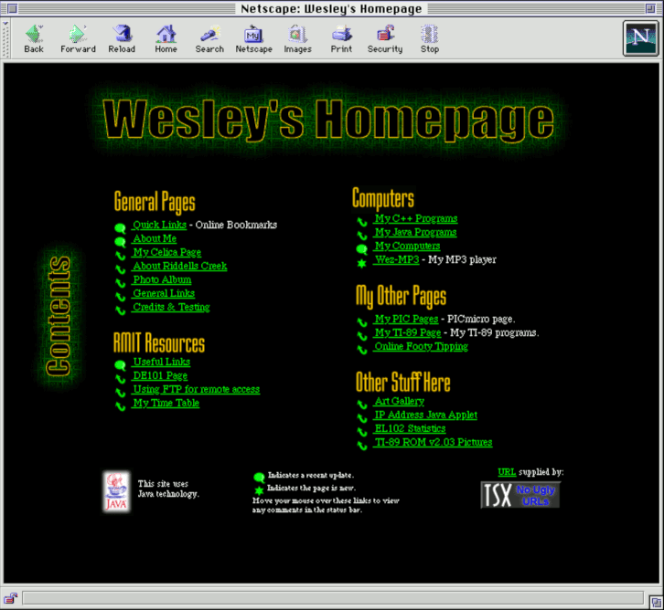

I recently rediscovered an archive of my homepage from June 2000 in the web archive.
This coupled with Ruben launching [Ruben's Retro Corner][ruben] made me want to have my
own retro corner of the Internet. 

So here we are. `www.7bit.org` was already the one place that I allowed plain
http access, it's just now got some content as well. The site is coded in
HTML4 Transitional so that it will work in old browsers running on old 
machines, like my Power Macintosh 9500 that you can read more about on
[the computers page](@/computers.md).

[ruben]: http://retro.rubenerd.com/
